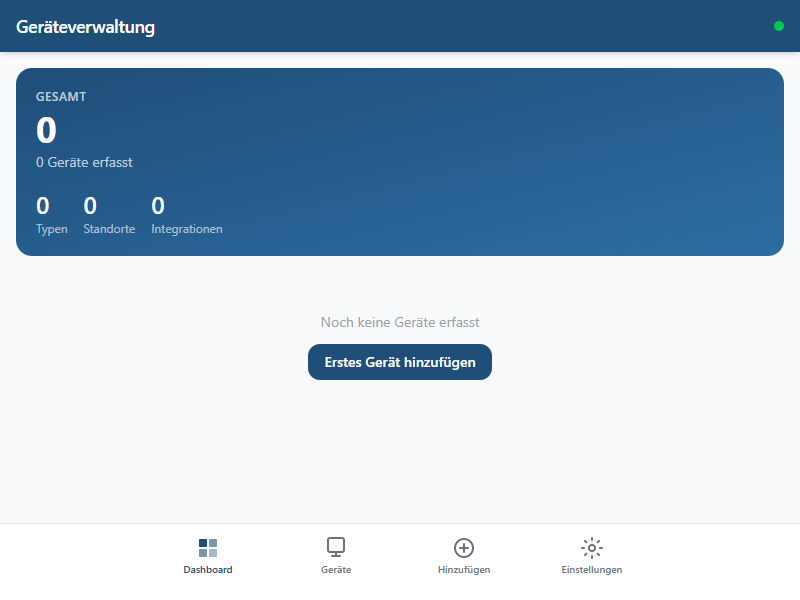
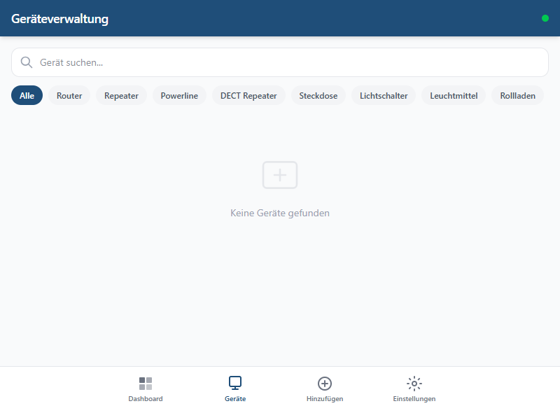
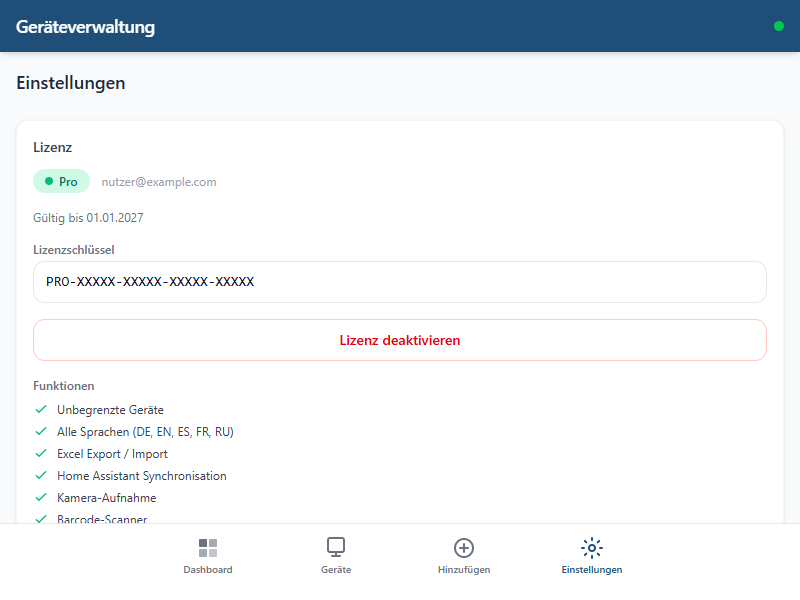
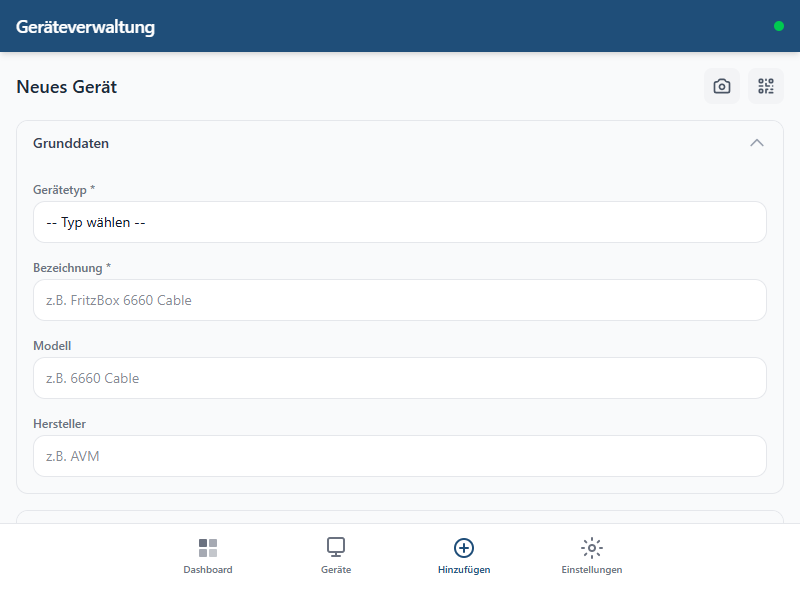
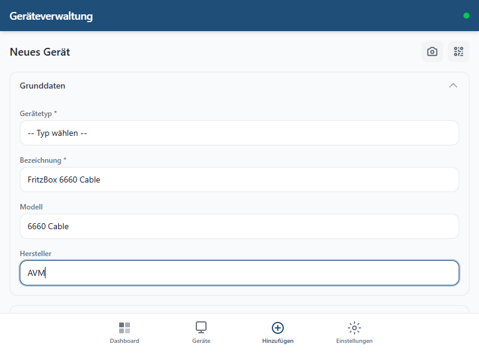
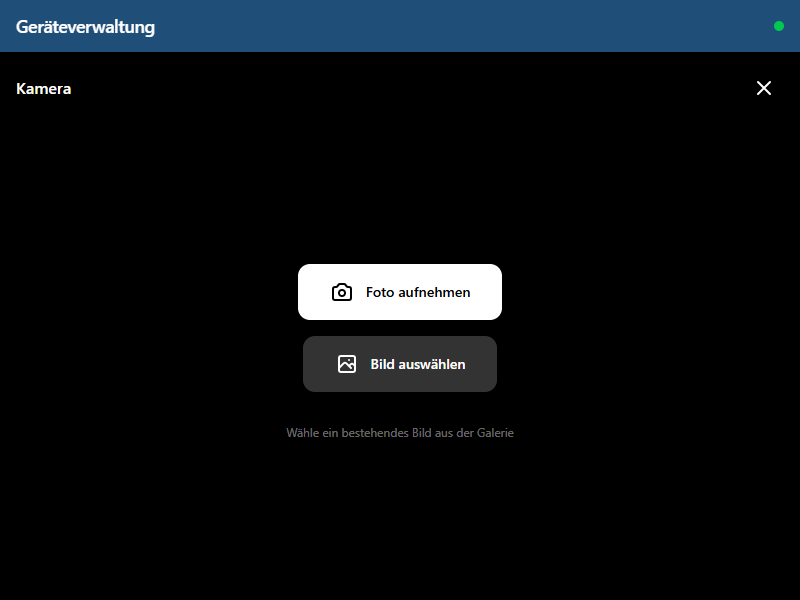

<h1 align="center">
  <br>
  Geraeteverwaltung
  <br>
</h1>

<h3 align="center">Smart Home Device Inventory for Home Assistant</h3>

<p align="center">
  Track, document, and manage every device in your smart home — from routers and sensors to cameras and thermostats. Built as a native Home Assistant Add-on.
</p>

<p align="center">
  
  
  
  
  
</p>

<p align="center">
  <a href="#installation">Installation</a> &bull;
  <a href="#features">Features</a> &bull;
  <a href="#quick-start">Quick Start</a> &bull;
  <a href="#pro-license">Pro License</a> &bull;
  <a href="#contributing">Contributing</a>
</p>

---



## Why Geraeteverwaltung?

Most smart home users have dozens or even hundreds of devices spread across their home. Routers, sensors, smart plugs, cameras, thermostats, gateways -- and the list keeps growing. But where do you track serial numbers? Warranty dates? Which IP address belongs to which device? What firmware is running on that Zigbee sensor in the basement?

**Geraeteverwaltung solves this.** It gives you a single, searchable inventory of every device in your home -- directly inside Home Assistant.

### Use Cases

- **Insurance documentation** -- Maintain a complete inventory with serial numbers, purchase dates, and photos. If the worst happens, you have everything documented.

- **Warranty tracking** -- Record purchase dates and warranty expiration for every device. Never miss a warranty claim again.

- **Maintenance overview** -- Firmware versions, IP addresses, MAC addresses, network types, and integrations at a glance. No more hunting through router admin pages.

- **Rental property management** -- Document equipment in rental units separately from your own home. Know exactly what belongs where when tenants move in or out.

- **Tax documentation** -- Track business equipment with purchase dates and costs for tax reporting.

- **Quick setup with HA import** -- Instead of manually entering 200+ devices, import your entire Home Assistant device registry with one click. Device types, manufacturers, and models are detected automatically.

- **Multi-device access** -- View and edit your inventory from your phone on-site, your tablet on the couch, or your desktop in the office. Changes sync automatically within 30 seconds.

- **Offline capable** -- Works without internet. Add devices in the basement with no Wi-Fi signal, and everything syncs when you are back online.

---

## Features

| Feature | Free | Pro |
|---------|:----:|:---:|
| Device inventory (CRUD) | 50 devices | **Unlimited** |
| Offline-first PWA | Yes | Yes |
| HA Add-on with sidebar integration | Yes | Yes |
| Area & floor mapping | Yes | Yes |
| JSON export | Yes | Yes |
| 22 device type categories | Yes | Yes |
| Network & power source tracking | Yes | Yes |
| Languages | English | **DE, EN, ES, FR, RU** |
| One-click HA device import | -- | **Yes** |
| Smart type detection from HA data | -- | **Yes** |
| Duplicate detection on import | -- | **Yes** |
| Excel export | -- | **Yes** |
| Camera capture with live preview | -- | **Yes** |
| QR / Barcode scanner with auto-fill | -- | **Yes** |
| Photo gallery per device | -- | **Yes** |
| Bidirectional sync across devices | -- | **Yes** |

### Highlighted Capabilities

- **One-click HA device import** -- Imports your entire Home Assistant device registry. Manufacturers, models, and integrations are mapped automatically. Safe to run multiple times thanks to duplicate detection.

- **Smart type detection** -- Devices are automatically categorized (Router, Camera, Thermostat, etc.) based on their Home Assistant integration data.

- **Camera capture** -- Take photos of devices directly from the app with a live camera preview. Photos are stored in the backend and synced across all your devices.

- **QR / Barcode scanner** -- Scan serial numbers, barcodes, or QR codes and have them auto-fill into the device form. No more typing 20-digit serial numbers by hand.

- **Offline-first architecture** -- All data is stored locally in your browser (IndexedDB). The app works completely offline and syncs with the backend when connectivity is restored.

- **Bidirectional sync** -- Edit a device on your phone and see the change on your desktop within 30 seconds. No manual refresh needed.

---

## Screenshots

| Dashboard | Geräteliste | Einstellungen |
|:---------:|:------------:|:--------------:|
|  |  |  |

| Neues Gerät | Formular ausgefüllt | Kamera |
|:---------:|:----------:|:------------:|
|  |  |  |

---

## Installation

### 1. Add the repository

1. Open Home Assistant
2. Go to **Settings** > **Add-ons** > **Add-on Store**
3. Click the three-dot menu (top right) > **Repositories**
4. Add this URL:
   ```
   https://github.com/DerRegner-DE/ha-device-inventory
   ```
5. Click **Add** and close the dialog

### 2. Install the add-on

1. Search for **Geraeteverwaltung** in the add-on store (you may need to refresh the page)
2. Click **Install**
3. Start the add-on
4. Enable **Show in sidebar** (recommended)
5. Click **Open Web UI**

### 3. Activate Pro (optional)

1. Open the app and go to **Settings**
2. Enter your license key
3. Click **Activate**
4. All Pro features are unlocked immediately

---

## Quick Start

1. **Add your first device** -- Tap the **+** button
2. **Choose a type** -- Select from 22 categories (Router, Camera, Thermostat, etc.)
3. **Fill in the basics** -- Name, model, manufacturer, serial number
4. **Set the location** -- Pick a floor and area from your Home Assistant setup
5. **Add network details** -- IP address, MAC address, integration, network type
6. **Record warranty info** -- Purchase date and warranty expiration
7. **Take a photo** (Pro) -- Use the camera button for a live preview capture
8. **Scan a barcode** (Pro) -- Capture serial numbers or product codes instantly

### Import from Home Assistant (Pro)

Instead of entering devices manually, use the **HA Import** feature:

1. Go to **Settings** > **Import from Home Assistant**
2. Click **Start Import**
3. The app imports your entire HA device registry with manufacturers, models, and integration info
4. Review and enrich the imported devices with additional details (serial numbers, photos, warranty dates)

The import is safe to run repeatedly -- existing devices are detected and skipped automatically.

---

## Pro License

**EUR 9.99** -- one-time purchase, no subscription.

| | Free | Pro |
|--|:----:|:---:|
| Price | Free | EUR 9.99 (one-time) |
| Device limit | 50 | Unlimited |
| Languages | EN | DE, EN, ES, FR, RU |
| HA Import | -- | Yes |
| Excel Export | -- | Yes |
| Camera & QR Scanner | -- | Yes |
| Photo Gallery | -- | Yes |
| Cross-device Sync | -- | Yes |

**[Buy Pro License](https://derregner.lemonsqueezy.com/checkout/buy/a3809409-6ce4-467d-a399-750150f65c39)** -- Instant delivery. Your license key will be included in the purchase confirmation email. You can activate it on up to 3 installations.

---

## Technical Requirements

### HTTPS for Camera and QR Scanner

The camera and QR scanner features require a **secure context** (HTTPS). This is a browser security requirement, not a limitation of the app.

- **Home Assistant with Nabu Casa** -- Works out of the box (remote access is HTTPS)
- **Home Assistant on local network** -- Access via `https://` (requires SSL certificate) or `localhost`
- **HTTP only** -- Camera and QR features will not be available; all other features work normally

### System Requirements

- **Home Assistant** 2024.1 or newer
- **Supported architectures:** amd64, aarch64, armv7
- **Browser:** Any modern browser (Chrome, Firefox, Safari, Edge)
- **Storage:** ~50 MB for the add-on + your device photos

---

## Supported Device Types

The app includes 22 predefined device categories with dedicated icons:

| | | | |
|--|--|--|--|
| Router | Repeater | Powerline Adapter | DECT Repeater |
| Smart Plug / Outlet | Light Switch | Light Bulb | Shutter / Blind |
| Thermostat | Controller / Gateway | Camera | Doorbell |
| Chime | Voice Assistant | Streaming Device | Tablet |
| Speaker | Robot Mower | Printer | Sensor |
| Smartphone | Other | | |

Each device can also track:
- **Network type:** Wi-Fi, LAN, Zigbee, Bluetooth, DECT, Powerline, HomeMatic RF, USB
- **Power source:** Adapter, Mains (230V), Battery, Rechargeable, USB, PoE, Solar, High Voltage
- **Integration:** Fritz, Zigbee2MQTT, Tuya, LocalTuya, Bosch SHC, HomeMatic IP, Ring, Blink, Alexa, TP-Link, Tasmota, MQTT, and more

---

## Architecture

```
geraeteverwaltung/
  frontend/           Preact + TypeScript + Tailwind CSS 4 (PWA)
  backend/            FastAPI + SQLite + openpyxl
  addon/              Home Assistant Add-on (Docker: nginx + uvicorn)
```

- **Frontend:** Preact, Dexie.js (IndexedDB), Tailwind CSS 4, html5-qrcode
- **Backend:** FastAPI, SQLite, openpyxl (Excel), aiohttp
- **Add-on:** Docker multi-stage build (Node.js build + Python runtime + nginx)
- **Sync:** Offline-first with queue-based sync to backend

---

## Roadmap

Planned features and improvements (no timeline guaranteed):

- [ ] Dashboard with device statistics and charts
- [ ] Bulk editing of multiple devices
- [ ] PDF export for insurance documentation
- [ ] Maintenance log / history per device
- [ ] Custom device type definitions
- [ ] Notification when warranty is about to expire
- [ ] Direct link to HA device page from inventory
- [ ] API for external integrations
- [ ] Dark mode support

Have an idea? [Open an issue](https://github.com/DerRegner-DE/ha-device-inventory/issues) to suggest a feature.

---

## Development

### Frontend

```bash
cd frontend
npm install
npm run dev          # Vite dev server on :5173
npm run build        # Production build to dist/
```

### Backend

```bash
cd backend
pip install -r requirements.txt
uvicorn app.main:app --reload --port 3002
```

### Docker (full stack)

```bash
docker build -f addon/Dockerfile -t geraeteverwaltung .
docker run -p 3001:3001 geraeteverwaltung
```

---

## Contributing

Contributions are welcome! Here is how to get started:

1. Fork the repository
2. Create a feature branch (`git checkout -b feature/my-feature`)
3. Make your changes
4. Test locally with the Docker build
5. Submit a pull request

Please open an issue first for larger changes to discuss the approach.

---

## License & Legal

- **Source code:** Source-available. See [LICENSE](LICENSE) for details.
- **Pro features:** Require a commercial license key (EUR 9.99 one-time).
- **Free tier:** Fully functional for up to 50 devices in English.

**Geraeteverwaltung** is not affiliated with or endorsed by Home Assistant or Nabu Casa.

---

## Links

- [Home Assistant](https://www.home-assistant.io/)
- [Report Issues](https://github.com/DerRegner-DE/ha-device-inventory/issues)
- [Buy Pro License](mailto:support@derregner.de?subject=Ger%C3%A4teverwaltung%20Pro%20License)

---

<p align="center">
  Made with care by <a href="https://github.com/DerRegner-DE">DerRegner-DE</a>
</p>
